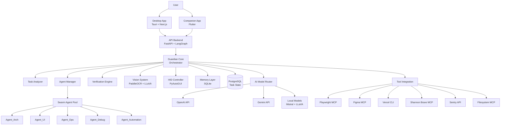

# Design Document: Project Guardian

## Overview

Project Guardian is a vision-native autonomous orchestrator that manages computer tasks through a swarm-based architecture. The system consists of three primary layers:

1. **Orchestration Layer**: The Guardian core that analyzes requests, decomposes tasks, and manages agent lifecycle
2. **Execution Layer**: Ephemeral specialized agents (Swarm_Agents) that execute specific sub-tasks in parallel
3. **Perception Layer**: Vision and verification systems that monitor execution and validate correctness

The architecture follows a hub-and-spoke model where Guardian acts as the central coordinator, spawning specialized agents as needed and terminating them upon completion. This approach overcomes single-threaded limitations by enabling parallel execution while maintaining centralized oversight.

Key architectural principles:
- **Ephemeral Agents**: Agents are short-lived and task-specific, preventing state accumulation and complexity
- **Vision-First**: Screen understanding drives verification and UI automation rather than relying solely on APIs
- **Autonomous Correction**: Failed agents are automatically respawned with error context and corrections
- **Parallel Execution**: Independent tasks execute concurrently to minimize total completion time
- **Multi-Modal AI**: Different models are selected based on task requirements (cost, speed, quality)

## Architecture

### System Components



### Technology Stack

**Desktop Application (Frontend)**
- Framework: Tauri 2.0 (Rust backend, web frontend)
- UI Framework: Next.js 16.1 with React
- Visualization: React Flow for task graph display
- State Management: Zustand for client-side state
- Rationale: Tauri provides native performance with web UI flexibility, minimal resource footprint

**Companion Mobile App**
- Framework: Flutter/Dart
- Rationale: Cross-platform support (iOS/Android) with single codebase, native performance

**API Backend**
- Framework: FastAPI (Python)
- Orchestration: LangGraph for agent workflow management
- LLM Integration: LangChain for model interaction patterns
- Rationale: Python ecosystem for AI/ML, FastAPI for async performance, LangGraph for complex agent workflows

**Vision and OCR**
- OCR Engine: PaddleOCR
- Vision Model: LLaVA (local)
- Rationale: PaddleOCR for multilingual text extraction, LLaVA for local vision understanding without API costs

**AI Models**
- Cloud: OpenAI API, Gemini API
- Local: Mistral (text generation), LLaVA (vision)
- Rationale: Flexibility to optimize for cost vs. quality, local fallback for privacy/offline scenarios

**Automation and Control**
- HID Simulation: PyAutoGUI
- Browser Automation: Playwright MCP
- Rationale: PyAutoGUI for universal input simulation, Playwright for structured browser control

**Data Storage**
- Primary Database: PostgreSQL
- Memory Layer: SQLite
- Rationale: PostgreSQL for reliable task state persistence, SQLite for fast local memory queries

**External Integrations**
- Playwright MCP: Browser automation
- Figma MCP: Design asset access
- Vercel CLI: Deployment automation
- Shannon Brave MCP: Web search
- Sentry API: Error tracking
- Filesystem MCP: Safe file operations

### Communication Patterns

**Desktop App ↔ API Backend**
- REST API for task submission, configuration, and queries
- WebSocket for real-time task progress updates
- Server-Sent Events (SSE) for streaming logs

**Guardian ↔ Swarm Agents**
- Process-based isolation (separate Python processes)
- JSON-based message passing for task specs and results
- Shared memory for large data transfers (screenshots, file content)

**Guardian ↔ Vision System**
- Synchronous function calls for screen capture
- Async processing for OCR and vision model inference
- Result caching to avoid redundant processing

**Guardian ↔ External Tools**
- MCP (Model Context Protocol) for standardized tool integration
- CLI subprocess execution for tools like Vercel
- REST APIs for services like Sentry

## Components and Interfaces

### Guardian Core

The central orchestrator responsible for task lifecycle management.

**Responsibilities:**
- Parse and analyze user requests
- Decompose requests into task graphs
- Spawn and manage swarm agents
- Monitor execution and verify results
- Handle errors and retry logic
- Coordinate with vision and HID systems

**Key Methods:**

```python
class GuardianCore:
    def analyze_request(self, user_request: str) -> TaskGraph:
        """
        Analyzes natural language request and creates task graph.
        
        Args:
            user_request: Natural language description of desired task
            
        Returns:
            TaskGraph with nodes representing sub-tasks and edges representing dependencies
        """
        
    def spawn_agent(self, agent_spec: AgentSpec) -> SwarmAgent:
        """
        Creates and initializes a new swarm agent.
        
        Args:
            agent_spec: Configuration including agent type, task description, context
            
        Returns:
            Running SwarmAgent instance
        """
        
    def verify_output(self, agent_id: str, output: AgentOutput) -> VerificationResult:
        """
        Validates agent output against expected criteria.
        
        Args:
            agent_id: Unique identifier of the agent
            output: The output produced by the agent
            
        Returns:
            VerificationResult indicating success or specific failures
        """
        
    def handle_failure(self, agent_id: str, error: AgentError) -> RetryDecision:
        """
        Analyzes agent failure and determines retry strategy.
        
        Args:
            agent_id: Unique identifier of the failed agent
            error: Error information including type, message, context
            
        Returns:
            RetryDecision indicating whether to retry, escalate, or abort
        """
        
    def execute_task_graph(self, task_graph: TaskGraph) -> ExecutionResult:
        """
        Orchestrates execution of entire task graph with parallel execution.
        
        Args:
            task_graph: The decomposed task structure
            
        Returns:
            ExecutionResult with outputs from all agents and overall status
        """
```

### Task Analyzer

Decomposes user requests into executable task graphs.

**Responsibilities:**
- Parse natural language requests using LLM
- Identify task dependencies and execution order
- Assign agent specializations to tasks
- Detect ambiguities and request clarification

**Key Data Structures:**

```python
@dataclass
class TaskNode:
    """Represents a single task in the graph."""
    id: str
    description: str
    agent_type: AgentType  # ARCH, UI, OPS, DEBUG, AUTOMATION
    dependencies: List[str]  # IDs of tasks that must complete first
    context: Dict[str, Any]  # Additional context for the agent
    estimated_duration: Optional[int]  # Seconds
    
@dataclass
class TaskGraph:
    """Directed acyclic graph of tasks."""
    nodes: Dict[str, TaskNode]
    root_task_id: str
    metadata: Dict[str, Any]  # Original request, user preferences, etc.
    
    def get_ready_tasks(self) -> List[TaskNode]:
        """Returns tasks with all dependencies satisfied."""
        
    def mark_complete(self, task_id: str, output: Any) -> None:
        """Marks task as complete and stores output."""
        
    def get_execution_order(self) -> List[List[TaskNode]]:
        """Returns tasks grouped by execution wave (parallel batches)."""
```

**Key Methods:**

```python
class TaskAnalyzer:
    def parse_request(self, request: str, context: UserContext) -> Intent:
        """
        Extracts primary intent from natural language request.
        
        Args:
            request: User's natural language input
            context: User context including history, preferences
            
        Returns:
            Intent object with classified request type and extracted entities
        """
        
    def decompose_to_graph(self, intent: Intent) -> TaskGraph:
        """
        Creates task graph from parsed intent.
        
        Args:
            intent: The classified and parsed user intent
            
        Returns:
            TaskGraph with all sub-tasks and dependencies
        """
        
    def identify_ambiguities(self, task_graph: TaskGraph) -> List[Clarification]:
        """
        Detects missing information or ambiguous requirements.
        
        Args:
            task_graph: The proposed task structure
            
        Returns:
            List of clarification questions to ask the user
        """
```

### Agent Manager

Manages the lifecycle of swarm agents including spawning, monitoring, and termination.

**Responsibilities:**
- Spawn agents with proper isolation
- Monitor agent health and resource usage
- Enforce resource limits (max concurrent agents, memory)
- Collect agent outputs and errors
- Terminate completed or failed agents

**Key Methods:**

```python
class AgentManager:
    def __init__(self, max_concurrent: int, memory_limit_mb: int):
        self.max_concurrent = max_concurrent
        self.memory_limit_mb = memory_limit_mb
        self.active_agents: Dict[str, SwarmAgent] = {}
        self.agent_queue: Queue[AgentSpec] = Queue()
        
    def spawn(self, spec: AgentSpec) -> str:
        """
        Spawns a new agent if resources available, otherwise queues.
        
        Args:
            spec: Agent specification including type and task
            
        Returns:
            Agent ID for tracking
        """
        
    def monitor_agent(self, agent_id: str) -> AgentStatus:
        """
        Checks agent health and progress.
        
        Args:
            agent_id: Unique identifier of the agent
            
        Returns:
            AgentStatus with current state, progress, resource usage
        """
        
    def collect_output(self, agent_id: str) -> AgentOutput:
        """
        Retrieves output from completed agent.
        
        Args:
            agent_id: Unique identifier of the agent
            
        Returns:
            AgentOutput with results, logs, and metadata
        """
        
    def terminate(self, agent_id: str, reason: str) -> None:
        """
        Gracefully terminates an agent and cleans up resources.
        
        Args:
            agent_id: Unique identifier of the agent
            reason: Reason for termination (completed, failed, cancelled)
        """
        
    def process_queue(self) -> None:
        """
        Spawns queued agents as resources become available.
        """
```

### Swarm Agent

Base class for specialized ephemeral agents.

**Agent Specializations:**
- **Agent_Arch**: File structure, project scaffolding, architecture decisions
- **Agent_UI**: CSS, Tailwind, React components, visual design implementation
- **Agent_Ops**: Server management, deployment, infrastructure, DevOps tasks
- **Agent_Debug**: Log analysis, error diagnosis, patch application
- **Agent_Automation**: UI navigation, form filling, workflow automation

**Key Methods:**

```python
class SwarmAgent(ABC):
    def __init__(self, spec: AgentSpec, context: ExecutionContext):
        self.spec = spec
        self.context = context
        self.status = AgentStatus.INITIALIZING
        
    @abstractmethod
    def execute(self) -> AgentOutput:
        """
        Executes the assigned task.
        
        Returns:
            AgentOutput with results and metadata
        """
        
    def report_progress(self, progress: float, message: str) -> None:
        """
        Reports progress back to Guardian.
        
        Args:
            progress: Completion percentage (0.0 to 1.0)
            message: Human-readable progress description
        """
        
    def request_tool(self, tool_name: str, params: Dict) -> Any:
        """
        Requests access to external tool through Guardian.
        
        Args:
            tool_name: Name of the tool (playwright, figma, etc.)
            params: Tool-specific parameters
            
        Returns:
            Tool execution result
        """
```

### Vision System

Captures and analyzes screen content for verification and UI automation.

**Responsibilities:**
- Capture screenshots of full screen or specific regions
- Extract text using OCR (PaddleOCR)
- Identify UI elements (buttons, forms, dialogs)
- Detect screen state changes
- Compare expected vs. actual visual state

**Key Methods:**

```python
class VisionSystem:
    def __init__(self):
        self.ocr_engine = PaddleOCR()
        self.vision_model = LLaVA()
        self.screen_cache: Dict[str, Screenshot] = {}
        
    def capture_screen(self, region: Optional[Region] = None) -> Screenshot:
        """
        Captures current screen content.
        
        Args:
            region: Optional bounding box to capture specific area
            
        Returns:
            Screenshot object with image data and metadata
        """
        
    def extract_text(self, screenshot: Screenshot) -> List[TextRegion]:
        """
        Extracts text from screenshot using OCR.
        
        Args:
            screenshot: The captured screen image
            
        Returns:
            List of TextRegion objects with text content and bounding boxes
        """
        
    def identify_elements(self, screenshot: Screenshot) -> List[UIElement]:
        """
        Identifies UI elements in screenshot.
        
        Args:
            screenshot: The captured screen image
            
        Returns:
            List of UIElement objects (buttons, inputs, etc.) with locations
        """
        
    def detect_change(self, previous: Screenshot, current: Screenshot) -> ChangeDetection:
        """
        Detects differences between two screenshots.
        
        Args:
            previous: Earlier screenshot
            current: Current screenshot
            
        Returns:
            ChangeDetection with regions that changed and change type
        """
        
    def verify_state(self, expected: StateDescription, screenshot: Screenshot) -> bool:
        """
        Verifies that screenshot matches expected state.
        
        Args:
            expected: Description of expected visual state
            screenshot: Current screen capture
            
        Returns:
            True if state matches, False otherwise
        """
```

### HID Controller

Simulates human interface device input for UI automation.

**Responsibilities:**
- Simulate keyboard typing with human-like timing
- Move mouse cursor and trigger clicks
- Coordinate with Vision System to locate click targets
- Introduce realistic delays to avoid detection
- Simulate scroll gestures

**Key Methods:**

```python
class HIDController:
    def __init__(self, typing_speed_wpm: int = 60):
        self.typing_speed_wpm = typing_speed_wpm
        self.human_delay_range = (0.05, 0.15)  # seconds
        
    def type_text(self, text: str, field_location: Optional[Point] = None) -> None:
        """
        Types text with human-like speed and errors.
        
        Args:
            text: The text to type
            field_location: Optional location to click before typing
        """
        
    def click(self, location: Point, button: MouseButton = MouseButton.LEFT) -> None:
        """
        Moves mouse and clicks at location.
        
        Args:
            location: Screen coordinates to click
            button: Which mouse button to click
        """
        
    def find_and_click(self, element_description: str, screenshot: Screenshot) -> bool:
        """
        Locates element visually and clicks it.
        
        Args:
            element_description: Natural language description of element
            screenshot: Current screen capture
            
        Returns:
            True if element found and clicked, False otherwise
        """
        
    def scroll(self, direction: ScrollDirection, amount: int) -> None:
        """
        Simulates scroll gesture.
        
        Args:
            direction: UP, DOWN, LEFT, RIGHT
            amount: Number of scroll units
        """
        
    def add_human_delay(self) -> None:
        """
        Adds random delay to simulate human timing.
        """
```

### Verification Engine

Validates agent outputs and determines if tasks completed successfully.

**Responsibilities:**
- Define verification criteria for different task types
- Execute verification checks (code compilation, visual QA, etc.)
- Identify specific failure reasons
- Generate correction instructions for failed agents

**Key Methods:**

```python
class VerificationEngine:
    def verify(self, output: AgentOutput, criteria: VerificationCriteria) -> VerificationResult:
        """
        Verifies agent output against criteria.
        
        Args:
            output: The output produced by an agent
            criteria: Expected characteristics and validation rules
            
        Returns:
            VerificationResult with pass/fail and specific issues
        """
        
    def verify_code(self, code: str, language: str) -> CodeVerification:
        """
        Verifies code compiles and passes basic checks.
        
        Args:
            code: Source code to verify
            language: Programming language
            
        Returns:
            CodeVerification with syntax errors, warnings, suggestions
        """
        
    def verify_ui(self, app_url: str, design_spec: DesignSpec) -> UIVerification:
        """
        Performs visual QA on UI using browser automation.
        
        Args:
            app_url: URL of the application to test
            design_spec: Expected visual characteristics
            
        Returns:
            UIVerification with visual defects and screenshots
        """
        
    def generate_corrections(self, failure: VerificationResult) -> CorrectionInstructions:
        """
        Creates specific instructions to fix identified issues.
        
        Args:
            failure: The verification failure details
            
        Returns:
            CorrectionInstructions for respawning agent with fixes
        """
```

### Memory Layer

Persistent storage for learning from past executions.

**Responsibilities:**
- Store completed task graphs and outcomes
- Index executions for similarity search
- Surface relevant past executions for similar requests
- Record error patterns and successful resolutions
- Maintain user preferences and learned optimizations

**Key Methods:**

```python
class MemoryLayer:
    def __init__(self, db_path: str):
        self.db = sqlite3.connect(db_path)
        self.vector_index = VectorIndex()
        
    def store_execution(self, task_graph: TaskGraph, result: ExecutionResult) -> str:
        """
        Stores completed execution for future reference.
        
        Args:
            task_graph: The task structure that was executed
            result: The execution outcome and outputs
            
        Returns:
            Execution ID for future retrieval
        """
        
    def find_similar(self, request: str, limit: int = 5) -> List[PastExecution]:
        """
        Finds similar past executions using vector similarity.
        
        Args:
            request: Current user request
            limit: Maximum number of results
            
        Returns:
            List of similar past executions with similarity scores
        """
        
    def record_error_pattern(self, error: AgentError, resolution: Resolution) -> None:
        """
        Records error and how it was resolved.
        
        Args:
            error: The error that occurred
            resolution: How the error was successfully resolved
        """
        
    def get_learned_optimizations(self, task_type: str) -> List[Optimization]:
        """
        Retrieves learned optimizations for task type.
        
        Args:
            task_type: Type of task being executed
            
        Returns:
            List of applicable optimizations from past executions
        """
```

### AI Model Router

Routes requests to appropriate AI models based on requirements.

**Responsibilities:**
- Select optimal model for each request (cost, speed, quality)
- Manage API keys and rate limits
- Implement fallback strategies for API failures
- Cache responses to reduce costs
- Track usage and costs per model

**Key Methods:**

```python
class AIModelRouter:
    def __init__(self, config: ModelConfig):
        self.config = config
        self.clients = {
            'openai': OpenAIClient(config.openai_key),
            'gemini': GeminiClient(config.gemini_key),
            'mistral': MistralLocal(config.mistral_path),
            'llava': LLaVALocal(config.llava_path)
        }
        
    def route_text_request(self, prompt: str, requirements: ModelRequirements) -> str:
        """
        Routes text generation request to appropriate model.
        
        Args:
            prompt: The text prompt
            requirements: Requirements for speed, cost, quality
            
        Returns:
            Generated text response
        """
        
    def route_vision_request(self, image: Image, prompt: str) -> str:
        """
        Routes vision request to appropriate vision model.
        
        Args:
            image: The image to analyze
            prompt: Question or instruction about the image
            
        Returns:
            Vision model response
        """
        
    def implement_fallback(self, primary_model: str, error: Exception) -> str:
        """
        Implements fallback strategy when primary model fails.
        
        Args:
            primary_model: The model that failed
            error: The error that occurred
            
        Returns:
            Name of fallback model to use
        """
```

### Tool Integration Manager

Manages connections to external tools and services.

**Responsibilities:**
- Initialize MCP connections for supported tools
- Execute tool operations on behalf of agents
- Handle tool authentication and permissions
- Manage tool-specific error handling

**Key Methods:**

```python
class ToolIntegrationManager:
    def __init__(self):
        self.tools = {
            'playwright': PlaywrightMCP(),
            'figma': FigmaMCP(),
            'vercel': VercelCLI(),
            'brave': BraveMCP(),
            'sentry': SentryAPI(),
            'filesystem': FilesystemMCP()
        }
        
    def execute_tool(self, tool_name: str, operation: str, params: Dict) -> Any:
        """
        Executes operation on specified tool.
        
        Args:
            tool_name: Name of the tool
            operation: Operation to perform
            params: Tool-specific parameters
            
        Returns:
            Tool operation result
        """
        
    def browser_automate(self, script: PlaywrightScript) -> BrowserResult:
        """
        Executes browser automation via Playwright.
        
        Args:
            script: Playwright automation script
            
        Returns:
            BrowserResult with screenshots, extracted data, errors
        """
        
    def deploy_app(self, project_path: str, platform: str) -> DeploymentResult:
        """
        Deploys application using appropriate CLI tool.
        
        Args:
            project_path: Path to project directory
            platform: Deployment platform (vercel, etc.)
            
        Returns:
            DeploymentResult with URL and deployment status
        """
```

## Data Models

### Core Data Structures

```python
from enum import Enum
from dataclasses import dataclass
from typing import List, Dict, Any, Optional
from datetime import datetime

class AgentType(Enum):
    """Types of specialized agents."""
    ARCH = "architecture"
    UI = "user_interface"
    OPS = "operations"
    DEBUG = "debugging"
    AUTOMATION = "automation"

class AgentStatus(Enum):
    """Agent lifecycle states."""
    INITIALIZING = "initializing"
    RUNNING = "running"
    COMPLETED = "completed"
    FAILED = "failed"
    TERMINATED = "terminated"

class TaskStatus(Enum):
    """Task execution states."""
    PENDING = "pending"
    READY = "ready"
    RUNNING = "running"
    COMPLETED = "completed"
    FAILED = "failed"
    BLOCKED = "blocked"

@dataclass
class AgentSpec:
    """Specification for spawning a swarm agent."""
    agent_type: AgentType
    task_description: str
    context: Dict[str, Any]
    dependencies: List[str]
    timeout_seconds: int
    retry_policy: RetryPolicy
    verification_criteria: VerificationCriteria

@dataclass
class ExecutionContext:
    """Runtime context provided to agents."""
    working_directory: str
    environment_vars: Dict[str, str]
    credentials: Dict[str, str]
    available_tools: List[str]
    parent_task_id: str
    user_preferences: Dict[str, Any]

@dataclass
class AgentOutput:
    """Output produced by an agent."""
    agent_id: str
    status: AgentStatus
    result: Any
    logs: List[str]
    errors: List[str]
    execution_time_seconds: float
    resources_used: ResourceUsage
    metadata: Dict[str, Any]

@dataclass
class VerificationCriteria:
    """Criteria for verifying agent output."""
    criteria_type: str  # code, ui, data, automation
    required_properties: List[str]
    validation_rules: List[ValidationRule]
    visual_checks: Optional[List[VisualCheck]]

@dataclass
class VerificationResult:
    """Result of output verification."""
    passed: bool
    issues: List[Issue]
    corrections: Optional[CorrectionInstructions]
    confidence: float

@dataclass
class RetryPolicy:
    """Policy for retrying failed agents."""
    max_attempts: int
    backoff_strategy: str  # exponential, linear, immediate
    retry_on_errors: List[str]  # Error types that trigger retry
    escalate_after: int  # Attempts before escalating to user

@dataclass
class Screenshot:
    """Captured screen content."""
    image_data: bytes
    timestamp: datetime
    region: Optional[Region]
    resolution: Tuple[int, int]
    metadata: Dict[str, Any]

@dataclass
class TextRegion:
    """Text extracted from screenshot."""
    text: str
    bounding_box: Region
    confidence: float
    language: str

@dataclass
class UIElement:
    """Identified UI element."""
    element_type: str  # button, input, link, dialog, etc.
    location: Region
    text: Optional[str]
    attributes: Dict[str, str]
    confidence: float

@dataclass
class Region:
    """Rectangular region on screen."""
    x: int
    y: int
    width: int
    height: int

@dataclass
class Point:
    """Screen coordinates."""
    x: int
    y: int

@dataclass
class PastExecution:
    """Historical execution record."""
    execution_id: str
    original_request: str
    task_graph: TaskGraph
    result: ExecutionResult
    timestamp: datetime
    similarity_score: float
    learned_insights: List[str]

@dataclass
class ExecutionResult:
    """Overall result of task graph execution."""
    success: bool
    outputs: Dict[str, AgentOutput]
    total_time_seconds: float
    agents_spawned: int
    retries_performed: int
    final_state: Dict[str, Any]
```

### Database Schema

**PostgreSQL Tables:**

```sql
-- Task execution history
CREATE TABLE executions (
    id UUID PRIMARY KEY,
    user_id UUID NOT NULL,
    original_request TEXT NOT NULL,
    task_graph JSONB NOT NULL,
    status VARCHAR(50) NOT NULL,
    created_at TIMESTAMP NOT NULL,
    completed_at TIMESTAMP,
    total_duration_seconds FLOAT,
    agents_spawned INT,
    retries_performed INT
);

-- Individual agent executions
CREATE TABLE agent_executions (
    id UUID PRIMARY KEY,
    execution_id UUID REFERENCES executions(id),
    agent_type VARCHAR(50) NOT NULL,
    task_description TEXT NOT NULL,
    status VARCHAR(50) NOT NULL,
    output JSONB,
    errors JSONB,
    started_at TIMESTAMP NOT NULL,
    completed_at TIMESTAMP,
    duration_seconds FLOAT
);

-- Verification results
CREATE TABLE verifications (
    id UUID PRIMARY KEY,
    agent_execution_id UUID REFERENCES agent_executions(id),
    passed BOOLEAN NOT NULL,
    issues JSONB,
    corrections JSONB,
    verified_at TIMESTAMP NOT NULL
);

-- Error patterns and resolutions
CREATE TABLE error_patterns (
    id UUID PRIMARY KEY,
    error_type VARCHAR(100) NOT NULL,
    error_context JSONB NOT NULL,
    resolution JSONB NOT NULL,
    success_rate FLOAT,
    occurrences INT DEFAULT 1,
    last_seen TIMESTAMP NOT NULL
);

-- User preferences and learned optimizations
CREATE TABLE user_preferences (
    user_id UUID PRIMARY KEY,
    preferences JSONB NOT NULL,
    learned_optimizations JSONB,
    updated_at TIMESTAMP NOT NULL
);

-- Tool usage tracking
CREATE TABLE tool_usage (
    id UUID PRIMARY KEY,
    execution_id UUID REFERENCES executions(id),
    tool_name VARCHAR(100) NOT NULL,
    operation VARCHAR(100) NOT NULL,
    success BOOLEAN NOT NULL,
    duration_seconds FLOAT,
    used_at TIMESTAMP NOT NULL
);

CREATE INDEX idx_executions_user ON executions(user_id);
CREATE INDEX idx_executions_status ON executions(status);
CREATE INDEX idx_agent_executions_execution ON agent_executions(execution_id);
CREATE INDEX idx_error_patterns_type ON error_patterns(error_type);
```

**SQLite Memory Layer:**

```sql
-- Vector embeddings for similarity search
CREATE TABLE execution_embeddings (
    execution_id TEXT PRIMARY KEY,
    request_embedding BLOB NOT NULL,
    request_text TEXT NOT NULL,
    task_graph_summary TEXT NOT NULL,
    success BOOLEAN NOT NULL,
    timestamp INTEGER NOT NULL
);

-- Cached vision analysis
CREATE TABLE vision_cache (
    screenshot_hash TEXT PRIMARY KEY,
    ocr_result TEXT,
    elements BLOB,
    analysis TEXT,
    cached_at INTEGER NOT NULL
);

-- Model response cache
CREATE TABLE model_cache (
    prompt_hash TEXT PRIMARY KEY,
    model_name TEXT NOT NULL,
    response TEXT NOT NULL,
    cached_at INTEGER NOT NULL,
    hit_count INTEGER DEFAULT 0
);

CREATE INDEX idx_embeddings_timestamp ON execution_embeddings(timestamp);
CREATE INDEX idx_vision_cache_timestamp ON vision_cache(cached_at);
CREATE INDEX idx_model_cache_timestamp ON model_cache(cached_at);
```

## 