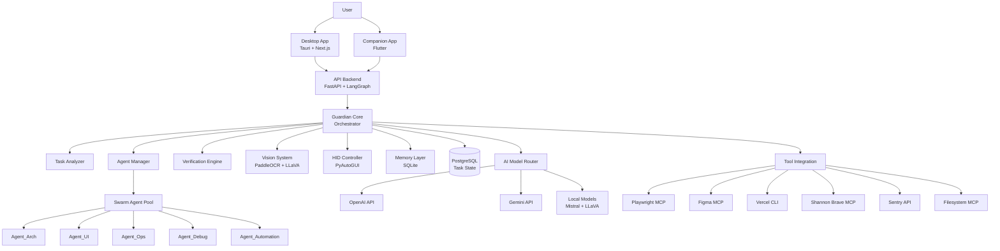

# Design Document: Project Guardian

## Overview

Project Guardian is a vision-native autonomous orchestrator that manages computer tasks through a swarm-based architecture. The system consists of three primary layers:

1. **Orchestration Layer**: The Guardian core that analyzes requests, decomposes tasks, and manages agent lifecycle
2. **Execution Layer**: Ephemeral specialized agents (Swarm_Agents) that execute specific sub-tasks in parallel
3. **Perception Layer**: Vision and verification systems that monitor execution and validate correctness

The architecture follows a hub-and-spoke model where Guardian acts as the central coordinator, spawning specialized agents as needed and terminating them upon completion. This approach overcomes single-threaded limitations by enabling parallel execution while maintaining centralized oversight.

Key architectural principles:
- **Ephemeral Agents**: Agents are short-lived and task-specific, preventing state accumulation and complexity
- **Vision-First**: Screen understanding drives verification and UI automation rather than relying solely on APIs
- **Autonomous Correction**: Failed agents are automatically respawned with error context and corrections
- **Parallel Execution**: Independent tasks execute concurrently to minimize total completion time
- **Multi-Modal AI**: Different models are selected based on task requirements (cost, speed, quality)

## Architecture

### System Components



### Technology Stack

#### Frontend Technologies

**Desktop Application**
- **Runtime**: Tauri 2.0
  - Rust backend for native system access and performance
  - Web-based frontend for UI flexibility
  - Cross-platform support (Windows, macOS, Linux)
  - Minimal resource footprint compared to Electron
  
- **UI Framework**: Next.js 16.1
  - React 18+ for component architecture
  - Server-side rendering capabilities
  - Built-in routing and optimization
  
- **UI Libraries**:
  - React Flow: Interactive task graph visualization
  - Tailwind CSS: Utility-first styling
  - Shadcn/ui: Accessible component primitives
  
- **State Management**: Zustand
  - Lightweight state management
  - TypeScript support
  - Minimal boilerplate
  
- **Communication**:
  - WebSocket client for real-time updates
  - REST client (fetch/axios) for API calls
  - Tauri IPC for Rust backend communication

**Companion Mobile App**
- **Framework**: Flutter 3.x
  - Dart programming language
  - Cross-platform (iOS and Android)
  - Native performance
  - Single codebase
  
- **State Management**: Riverpod or Provider
  - Reactive state management
  - Dependency injection
  
- **Communication**:
  - HTTP client (dio) for REST API
  - WebSocket for real-time updates
  - Firebase Cloud Messaging for push notifications

#### Backend Technologies

**API Server**
- **Framework**: FastAPI (Python 3.11+)
  - Async/await support for concurrent operations
  - Automatic OpenAPI documentation
  - Type hints and validation with Pydantic
  - High performance (comparable to Node.js/Go)
  
- **Web Server**: Uvicorn
  - ASGI server for FastAPI
  - WebSocket support
  - Production-ready performance
  
- **Agent Orchestration**: LangGraph
  - State machine for agent workflows
  - Cycle detection and management
  - Checkpoint and recovery support
  
- **LLM Integration**: LangChain
  - Unified interface for multiple LLM providers
  - Prompt templates and chains
  - Memory and context management
  - Tool/function calling abstractions

**Process Management**
- **Multiprocessing**: Python multiprocessing module
  - Process isolation for agents
  - Shared memory for large data
  - Process pools for resource management
  
- **Task Queue**: Celery (optional for production)
  - Distributed task execution
  - Retry logic and error handling
  - Monitoring and management tools

#### AI and Machine Learning

**Cloud AI Services**
- **OpenAI API**:
  - GPT-4 Turbo for complex reasoning
  - GPT-3.5 Turbo for faster, cheaper tasks
  - GPT-4 Vision for image understanding
  
- **Google Gemini API**:
  - Gemini Pro for text generation
  - Gemini Pro Vision for multimodal tasks
  - Competitive pricing alternative

**Local AI Models**
- **Text Generation**: Mistral 7B
  - Open-source LLM
  - Runs locally via Ollama or llama.cpp
  - Privacy-preserving, no API costs
  
- **Vision**: LLaVA (Large Language and Vision Assistant)
  - Open-source vision-language model
  - Local image understanding
  - Multimodal reasoning

**Model Serving**
- **Ollama**: Local model serving
  - Easy model management
  - OpenAI-compatible API
  - GPU acceleration support
  
- **llama.cpp**: Alternative local serving
  - CPU-optimized inference
  - Quantization support
  - Lower memory requirements

#### Vision and Automation

**Computer Vision**
- **OCR**: PaddleOCR
  - Multilingual text recognition
  - High accuracy
  - Open-source
  - CPU and GPU support
  
- **Screen Capture**: 
  - Python: mss (fast cross-platform screenshots)
  - Pillow (PIL) for image processing
  
- **Image Processing**:
  - OpenCV for image manipulation
  - NumPy for array operations

**Human Interface Device Control**
- **PyAutoGUI**:
  - Cross-platform GUI automation
  - Keyboard and mouse control
  - Screen coordinate handling
  - Failsafe features
  
- **Alternative/Supplementary**:
  - pyautogui for basic automation
  - pynput for more control
  - Platform-specific APIs (Win32, Cocoa, X11) for advanced features

**Browser Automation**
- **Playwright**:
  - Headless and headed browser control
  - Multi-browser support (Chromium, Firefox, WebKit)
  - Network interception
  - Screenshot and PDF generation
  - Mobile emulation
  
- **Integration**: Playwright MCP (Model Context Protocol)
  - Standardized interface for LLM tool use
  - Structured browser automation commands

#### Data Storage

**Primary Database**
- **PostgreSQL 15+**:
  - ACID compliance for reliable state
  - JSONB for flexible schema
  - Full-text search capabilities
  - Vector extensions (pgvector) for embeddings
  - Robust indexing and query optimization
  
- **Connection Pooling**: asyncpg
  - Async PostgreSQL driver
  - Connection pooling
  - High performance

**Memory Layer**
- **SQLite 3**:
  - Embedded database
  - Zero configuration
  - Fast local queries
  - File-based storage
  
- **Vector Search**: 
  - sqlite-vss extension for vector similarity
  - Or in-memory FAISS for faster search

**Caching**
- **Redis** (optional for production):
  - In-memory caching
  - Session storage
  - Rate limiting
  - Pub/sub for real-time features

#### External Integrations

**Model Context Protocol (MCP) Tools**
- **Playwright MCP**: Browser automation
- **Figma MCP**: Design file access and export
- **Filesystem MCP**: Safe file operations with sandboxing
- **Shannon Brave MCP**: Web search via Brave Search API

**CLI Tools**
- **Vercel CLI**: Application deployment to Vercel
- **Git**: Version control operations
- **npm/yarn/pnpm**: Package management for Node.js projects

**APIs and Services**
- **Sentry**: Error tracking and monitoring
  - Python SDK for backend
  - JavaScript SDK for frontend
  - Performance monitoring
  - Release tracking
  
- **Brave Search API**: Web search results
- **Figma API**: Design file access (via MCP)

#### Development and Testing

**Testing Frameworks**
- **Python**:
  - pytest: Unit and integration testing
  - Hypothesis: Property-based testing
  - pytest-asyncio: Async test support
  - pytest-cov: Code coverage
  
- **TypeScript/JavaScript**:
  - Vitest: Fast unit testing
  - React Testing Library: Component testing
  - Playwright Test: E2E testing
  - fast-check: Property-based testing

**Code Quality**
- **Python**:
  - black: Code formatting
  - ruff: Fast linting
  - mypy: Static type checking
  - isort: Import sorting
  
- **TypeScript**:
  - ESLint: Linting
  - Prettier: Code formatting
  - TypeScript compiler: Type checking

**Development Tools**
- **Docker**: Containerization for PostgreSQL, Redis
- **Docker Compose**: Multi-container orchestration
- **Git**: Version control
- **GitHub Actions**: CI/CD pipelines

#### Infrastructure and Deployment

**Containerization**
- **Docker**: Application containerization
- **Docker Compose**: Local development environment

**Deployment Options**
- **Desktop App**: 
  - Tauri bundler for native installers
  - Auto-update support
  - Code signing for security
  
- **Mobile App**:
  - App Store (iOS) via Xcode
  - Google Play (Android) via Android Studio
  - TestFlight/Firebase App Distribution for beta testing
  
- **Backend**:
  - Self-hosted: Docker containers on VPS
  - Cloud: AWS ECS, Google Cloud Run, or DigitalOcean App Platform
  - Database: Managed PostgreSQL (AWS RDS, Supabase, etc.)

**Monitoring and Observability**
- **Sentry**: Error tracking
- **Prometheus** (optional): Metrics collection
- **Grafana** (optional): Metrics visualization
- **Structured logging**: JSON logs for analysis

#### Security

**Authentication and Authorization**
- **Desktop/Mobile**: 
  - JWT tokens for API authentication
  - OAuth 2.0 for third-party integrations
  - Biometric authentication (mobile)
  
- **Credential Storage**:
  - macOS: Keychain
  - Windows: Credential Manager
  - Linux: Secret Service API (libsecret)
  - Mobile: Secure Enclave (iOS), Keystore (Android)

**Encryption**
- **In Transit**: TLS/HTTPS for all network communication
- **At Rest**: 
  - Database encryption (PostgreSQL)
  - Encrypted credential storage
  - Encrypted local cache

**API Security**
- **Rate Limiting**: Token bucket algorithm
- **Input Validation**: Pydantic models
- **CORS**: Configured for desktop/mobile origins
- **API Keys**: Secure storage and rotation

#### Programming Languages Summary

- **Rust**: Tauri desktop app backend, system-level operations
- **TypeScript**: Desktop app frontend (Next.js/React)
- **Dart**: Mobile companion app (Flutter)
- **Python**: API backend, AI orchestration, agent execution
- **SQL**: Database queries and schema definitions

#### Key Dependencies Summary

**Python (Backend)**
```
fastapi>=0.104.0
uvicorn[standard]>=0.24.0
langchain>=0.1.0
langgraph>=0.0.20
openai>=1.3.0
google-generativeai>=0.3.0
paddleocr>=2.7.0
pyautogui>=0.9.54
playwright>=1.40.0
asyncpg>=0.29.0
psycopg2-binary>=2.9.9
pydantic>=2.5.0
hypothesis>=6.92.0
pytest>=7.4.0
sentry-sdk>=1.38.0
```

**TypeScript (Frontend)**
```
next@16.1.0
react@18.2.0
react-dom@18.2.0
@tauri-apps/api@2.0.0
zustand@4.4.0
reactflow@11.10.0
tailwindcss@3.4.0
axios@1.6.0
```

**Dart (Mobile)**
```
flutter: sdk
riverpod@2.4.0
dio@5.4.0
firebase_messaging@14.7.0
```

### Communication Patterns

**Desktop App ↔ API Backend**
- REST API for task submission, configuration, and queries
- WebSocket for real-time task progress updates
- Server-Sent Events (SSE) for streaming logs

**Guardian ↔ Swarm Agents**
- Process-based isolation (separate Python processes)
- JSON-based message passing for task specs and results
- Shared memory for large data transfers (screenshots, file content)

**Guardian ↔ Vision System**
- Synchronous function calls for screen capture
- Async processing for OCR and vision model inference
- Result caching to avoid redundant processing

**Guardian ↔ External Tools**
- MCP (Model Context Protocol) for standardized tool integration
- CLI subprocess execution for tools like Vercel
- REST APIs for services like Sentry

## Components and Interfaces

### Guardian Core

The central orchestrator responsible for task lifecycle management.

**Responsibilities:**
- Parse and analyze user requests
- Decompose requests into task graphs
- Spawn and manage swarm agents
- Monitor execution and verify results
- Handle errors and retry logic
- Coordinate with vision and HID systems

**Key Methods:**

```python
class GuardianCore:
    def analyze_request(self, user_request: str) -> TaskGraph:
        """
        Analyzes natural language request and creates task graph.
        
        Args:
            user_request: Natural language description of desired task
            
        Returns:
            TaskGraph with nodes representing sub-tasks and edges representing dependencies
        """
        
    def spawn_agent(self, agent_spec: AgentSpec) -> SwarmAgent:
        """
        Creates and initializes a new swarm agent.
        
        Args:
            agent_spec: Configuration including agent type, task description, context
            
        Returns:
            Running SwarmAgent instance
        """
        
    def verify_output(self, agent_id: str, output: AgentOutput) -> VerificationResult:
        """
        Validates agent output against expected criteria.
        
        Args:
            agent_id: Unique identifier of the agent
            output: The output produced by the agent
            
        Returns:
            VerificationResult indicating success or specific failures
        """
        
    def handle_failure(self, agent_id: str, error: AgentError) -> RetryDecision:
        """
        Analyzes agent failure and determines retry strategy.
        
        Args:
            agent_id: Unique identifier of the failed agent
            error: Error information including type, message, context
            
        Returns:
            RetryDecision indicating whether to retry, escalate, or abort
        """
        
    def execute_task_graph(self, task_graph: TaskGraph) -> ExecutionResult:
        """
        Orchestrates execution of entire task graph with parallel execution.
        
        Args:
            task_graph: The decomposed task structure
            
        Returns:
            ExecutionResult with outputs from all agents and overall status
        """
```

### Task Analyzer

Decomposes user requests into executable task graphs.

**Responsibilities:**
- Parse natural language requests using LLM
- Identify task dependencies and execution order
- Assign agent specializations to tasks
- Detect ambiguities and request clarification

**Key Data Structures:**

```python
@dataclass
class TaskNode:
    """Represents a single task in the graph."""
    id: str
    description: str
    agent_type: AgentType  # ARCH, UI, OPS, DEBUG, AUTOMATION
    dependencies: List[str]  # IDs of tasks that must complete first
    context: Dict[str, Any]  # Additional context for the agent
    estimated_duration: Optional[int]  # Seconds
    
@dataclass
class TaskGraph:
    """Directed acyclic graph of tasks."""
    nodes: Dict[str, TaskNode]
    root_task_id: str
    metadata: Dict[str, Any]  # Original request, user preferences, etc.
    
    def get_ready_tasks(self) -> List[TaskNode]:
        """Returns tasks with all dependencies satisfied."""
        
    def mark_complete(self, task_id: str, output: Any) -> None:
        """Marks task as complete and stores output."""
        
    def get_execution_order(self) -> List[List[TaskNode]]:
        """Returns tasks grouped by execution wave (parallel batches)."""
```

**Key Methods:**

```python
class TaskAnalyzer:
    def parse_request(self, request: str, context: UserContext) -> Intent:
        """
        Extracts primary intent from natural language request.
        
        Args:
            request: User's natural language input
            context: User context including history, preferences
            
        Returns:
            Intent object with classified request type and extracted entities
        """
        
    def decompose_to_graph(self, intent: Intent) -> TaskGraph:
        """
        Creates task graph from parsed intent.
        
        Args:
            intent: The classified and parsed user intent
            
        Returns:
            TaskGraph with all sub-tasks and dependencies
        """
        
    def identify_ambiguities(self, task_graph: TaskGraph) -> List[Clarification]:
        """
        Detects missing information or ambiguous requirements.
        
        Args:
            task_graph: The proposed task structure
            
        Returns:
            List of clarification questions to ask the user
        """
```

### Agent Manager

Manages the lifecycle of swarm agents including spawning, monitoring, and termination.

**Responsibilities:**
- Spawn agents with proper isolation
- Monitor agent health and resource usage
- Enforce resource limits (max concurrent agents, memory)
- Collect agent outputs and errors
- Terminate completed or failed agents

**Key Methods:**

```python
class AgentManager:
    def __init__(self, max_concurrent: int, memory_limit_mb: int):
        self.max_concurrent = max_concurrent
        self.memory_limit_mb = memory_limit_mb
        self.active_agents: Dict[str, SwarmAgent] = {}
        self.agent_queue: Queue[AgentSpec] = Queue()
        
    def spawn(self, spec: AgentSpec) -> str:
        """
        Spawns a new agent if resources available, otherwise queues.
        
        Args:
            spec: Agent specification including type and task
            
        Returns:
            Agent ID for tracking
        """
        
    def monitor_agent(self, agent_id: str) -> AgentStatus:
        """
        Checks agent health and progress.
        
        Args:
            agent_id: Unique identifier of the agent
            
        Returns:
            AgentStatus with current state, progress, resource usage
        """
        
    def collect_output(self, agent_id: str) -> AgentOutput:
        """
        Retrieves output from completed agent.
        
        Args:
            agent_id: Unique identifier of the agent
            
        Returns:
            AgentOutput with results, logs, and metadata
        """
        
    def terminate(self, agent_id: str, reason: str) -> None:
        """
        Gracefully terminates an agent and cleans up resources.
        
        Args:
            agent_id: Unique identifier of the agent
            reason: Reason for termination (completed, failed, cancelled)
        """
        
    def process_queue(self) -> None:
        """
        Spawns queued agents as resources become available.
        """
```

### Swarm Agent

Base class for specialized ephemeral agents.

**Agent Specializations:**
- **Agent_Arch**: File structure, project scaffolding, architecture decisions
- **Agent_UI**: CSS, Tailwind, React components, visual design implementation
- **Agent_Ops**: Server management, deployment, infrastructure, DevOps tasks
- **Agent_Debug**: Log analysis, error diagnosis, patch application
- **Agent_Automation**: UI navigation, form filling, workflow automation

**Key Methods:**

```python
class SwarmAgent(ABC):
    def __init__(self, spec: AgentSpec, context: ExecutionContext):
        self.spec = spec
        self.context = context
        self.status = AgentStatus.INITIALIZING
        
    @abstractmethod
    def execute(self) -> AgentOutput:
        """
        Executes the assigned task.
        
        Returns:
            AgentOutput with results and metadata
        """
        
    def report_progress(self, progress: float, message: str) -> None:
        """
        Reports progress back to Guardian.
        
        Args:
            progress: Completion percentage (0.0 to 1.0)
            message: Human-readable progress description
        """
        
    def request_tool(self, tool_name: str, params: Dict) -> Any:
        """
        Requests access to external tool through Guardian.
        
        Args:
            tool_name: Name of the tool (playwright, figma, etc.)
            params: Tool-specific parameters
            
        Returns:
            Tool execution result
        """
```

### Vision System

Captures and analyzes screen content for verification and UI automation.

**Responsibilities:**
- Capture screenshots of full screen or specific regions
- Extract text using OCR (PaddleOCR)
- Identify UI elements (buttons, forms, dialogs)
- Detect screen state changes
- Compare expected vs. actual visual state

**Key Methods:**

```python
class VisionSystem:
    def __init__(self):
        self.ocr_engine = PaddleOCR()
        self.vision_model = LLaVA()
        self.screen_cache: Dict[str, Screenshot] = {}
        
    def capture_screen(self, region: Optional[Region] = None) -> Screenshot:
        """
        Captures current screen content.
        
        Args:
            region: Optional bounding box to capture specific area
            
        Returns:
            Screenshot object with image data and metadata
        """
        
    def extract_text(self, screenshot: Screenshot) -> List[TextRegion]:
        """
        Extracts text from screenshot using OCR.
        
        Args:
            screenshot: The captured screen image
            
        Returns:
            List of TextRegion objects with text content and bounding boxes
        """
        
    def identify_elements(self, screenshot: Screenshot) -> List[UIElement]:
        """
        Identifies UI elements in screenshot.
        
        Args:
            screenshot: The captured screen image
            
        Returns:
            List of UIElement objects (buttons, inputs, etc.) with locations
        """
        
    def detect_change(self, previous: Screenshot, current: Screenshot) -> ChangeDetection:
        """
        Detects differences between two screenshots.
        
        Args:
            previous: Earlier screenshot
            current: Current screenshot
            
        Returns:
            ChangeDetection with regions that changed and change type
        """
        
    def verify_state(self, expected: StateDescription, screenshot: Screenshot) -> bool:
        """
        Verifies that screenshot matches expected state.
        
        Args:
            expected: Description of expected visual state
            screenshot: Current screen capture
            
        Returns:
            True if state matches, False otherwise
        """
```

### HID Controller

Simulates human interface device input for UI automation.

**Responsibilities:**
- Simulate keyboard typing with human-like timing
- Move mouse cursor and trigger clicks
- Coordinate with Vision System to locate click targets
- Introduce realistic delays to avoid detection
- Simulate scroll gestures

**Key Methods:**

```python
class HIDController:
    def __init__(self, typing_speed_wpm: int = 60):
        self.typing_speed_wpm = typing_speed_wpm
        self.human_delay_range = (0.05, 0.15)  # seconds
        
    def type_text(self, text: str, field_location: Optional[Point] = None) -> None:
        """
        Types text with human-like speed and errors.
        
        Args:
            text: The text to type
            field_location: Optional location to click before typing
        """
        
    def click(self, location: Point, button: MouseButton = MouseButton.LEFT) -> None:
        """
        Moves mouse and clicks at location.
        
        Args:
            location: Screen coordinates to click
            button: Which mouse button to click
        """
        
    def find_and_click(self, element_description: str, screenshot: Screenshot) -> bool:
        """
        Locates element visually and clicks it.
        
        Args:
            element_description: Natural language description of element
            screenshot: Current screen capture
            
        Returns:
            True if element found and clicked, False otherwise
        """
        
    def scroll(self, direction: ScrollDirection, amount: int) -> None:
        """
        Simulates scroll gesture.
        
        Args:
            direction: UP, DOWN, LEFT, RIGHT
            amount: Number of scroll units
        """
        
    def add_human_delay(self) -> None:
        """
        Adds random delay to simulate human timing.
        """
```

### Verification Engine

Validates agent outputs and determines if tasks completed successfully.

**Responsibilities:**
- Define verification criteria for different task types
- Execute verification checks (code compilation, visual QA, etc.)
- Identify specific failure reasons
- Generate correction instructions for failed agents

**Key Methods:**

```python
class VerificationEngine:
    def verify(self, output: AgentOutput, criteria: VerificationCriteria) -> VerificationResult:
        """
        Verifies agent output against criteria.
        
        Args:
            output: The output produced by an agent
            criteria: Expected characteristics and validation rules
            
        Returns:
            VerificationResult with pass/fail and specific issues
        """
        
    def verify_code(self, code: str, language: str) -> CodeVerification:
        """
        Verifies code compiles and passes basic checks.
        
        Args:
            code: Source code to verify
            language: Programming language
            
        Returns:
            CodeVerification with syntax errors, warnings, suggestions
        """
        
    def verify_ui(self, app_url: str, design_spec: DesignSpec) -> UIVerification:
        """
        Performs visual QA on UI using browser automation.
        
        Args:
            app_url: URL of the application to test
            design_spec: Expected visual characteristics
            
        Returns:
            UIVerification with visual defects and screenshots
        """
        
    def generate_corrections(self, failure: VerificationResult) -> CorrectionInstructions:
        """
        Creates specific instructions to fix identified issues.
        
        Args:
            failure: The verification failure details
            
        Returns:
            CorrectionInstructions for respawning agent with fixes
        """
```

### Memory Layer

Persistent storage for learning from past executions.

**Responsibilities:**
- Store completed task graphs and outcomes
- Index executions for similarity search
- Surface relevant past executions for similar requests
- Record error patterns and successful resolutions
- Maintain user preferences and learned optimizations

**Key Methods:**

```python
class MemoryLayer:
    def __init__(self, db_path: str):
        self.db = sqlite3.connect(db_path)
        self.vector_index = VectorIndex()
        
    def store_execution(self, task_graph: TaskGraph, result: ExecutionResult) -> str:
        """
        Stores completed execution for future reference.
        
        Args:
            task_graph: The task structure that was executed
            result: The execution outcome and outputs
            
        Returns:
            Execution ID for future retrieval
        """
        
    def find_similar(self, request: str, limit: int = 5) -> List[PastExecution]:
        """
        Finds similar past executions using vector similarity.
        
        Args:
            request: Current user request
            limit: Maximum number of results
            
        Returns:
            List of similar past executions with similarity scores
        """
        
    def record_error_pattern(self, error: AgentError, resolution: Resolution) -> None:
        """
        Records error and how it was resolved.
        
        Args:
            error: The error that occurred
            resolution: How the error was successfully resolved
        """
        
    def get_learned_optimizations(self, task_type: str) -> List[Optimization]:
        """
        Retrieves learned optimizations for task type.
        
        Args:
            task_type: Type of task being executed
            
        Returns:
            List of applicable optimizations from past executions
        """
```

### AI Model Router

Routes requests to appropriate AI models based on requirements.

**Responsibilities:**
- Select optimal model for each request (cost, speed, quality)
- Manage API keys and rate limits
- Implement fallback strategies for API failures
- Cache responses to reduce costs
- Track usage and costs per model

**Key Methods:**

```python
class AIModelRouter:
    def __init__(self, config: ModelConfig):
        self.config = config
        self.clients = {
            'openai': OpenAIClient(config.openai_key),
            'gemini': GeminiClient(config.gemini_key),
            'mistral': MistralLocal(config.mistral_path),
            'llava': LLaVALocal(config.llava_path)
        }
        
    def route_text_request(self, prompt: str, requirements: ModelRequirements) -> str:
        """
        Routes text generation request to appropriate model.
        
        Args:
            prompt: The text prompt
            requirements: Requirements for speed, cost, quality
            
        Returns:
            Generated text response
        """
        
    def route_vision_request(self, image: Image, prompt: str) -> str:
        """
        Routes vision request to appropriate vision model.
        
        Args:
            image: The image to analyze
            prompt: Question or instruction about the image
            
        Returns:
            Vision model response
        """
        
    def implement_fallback(self, primary_model: str, error: Exception) -> str:
        """
        Implements fallback strategy when primary model fails.
        
        Args:
            primary_model: The model that failed
            error: The error that occurred
            
        Returns:
            Name of fallback model to use
        """
```

### Tool Integration Manager

Manages connections to external tools and services.

**Responsibilities:**
- Initialize MCP connections for supported tools
- Execute tool operations on behalf of agents
- Handle tool authentication and permissions
- Manage tool-specific error handling

**Key Methods:**

```python
class ToolIntegrationManager:
    def __init__(self):
        self.tools = {
            'playwright': PlaywrightMCP(),
            'figma': FigmaMCP(),
            'vercel': VercelCLI(),
            'brave': BraveMCP(),
            'sentry': SentryAPI(),
            'filesystem': FilesystemMCP()
        }
        
    def execute_tool(self, tool_name: str, operation: str, params: Dict) -> Any:
        """
        Executes operation on specified tool.
        
        Args:
            tool_name: Name of the tool
            operation: Operation to perform
            params: Tool-specific parameters
            
        Returns:
            Tool operation result
        """
        
    def browser_automate(self, script: PlaywrightScript) -> BrowserResult:
        """
        Executes browser automation via Playwright.
        
        Args:
            script: Playwright automation script
            
        Returns:
            BrowserResult with screenshots, extracted data, errors
        """
        
    def deploy_app(self, project_path: str, platform: str) -> DeploymentResult:
        """
        Deploys application using appropriate CLI tool.
        
        Args:
            project_path: Path to project directory
            platform: Deployment platform (vercel, etc.)
            
        Returns:
            DeploymentResult with URL and deployment status
        """
```

## Data Models

### Core Data Structures

```python
from enum import Enum
from dataclasses import dataclass
from typing import List, Dict, Any, Optional
from datetime import datetime

class AgentType(Enum):
    """Types of specialized agents."""
    ARCH = "architecture"
    UI = "user_interface"
    OPS = "operations"
    DEBUG = "debugging"
    AUTOMATION = "automation"

class AgentStatus(Enum):
    """Agent lifecycle states."""
    INITIALIZING = "initializing"
    RUNNING = "running"
    COMPLETED = "completed"
    FAILED = "failed"
    TERMINATED = "terminated"

class TaskStatus(Enum):
    """Task execution states."""
    PENDING = "pending"
    READY = "ready"
    RUNNING = "running"
    COMPLETED = "completed"
    FAILED = "failed"
    BLOCKED = "blocked"

@dataclass
class AgentSpec:
    """Specification for spawning a swarm agent."""
    agent_type: AgentType
    task_description: str
    context: Dict[str, Any]
    dependencies: List[str]
    timeout_seconds: int
    retry_policy: RetryPolicy
    verification_criteria: VerificationCriteria

@dataclass
class ExecutionContext:
    """Runtime context provided to agents."""
    working_directory: str
    environment_vars: Dict[str, str]
    credentials: Dict[str, str]
    available_tools: List[str]
    parent_task_id: str
    user_preferences: Dict[str, Any]

@dataclass
class AgentOutput:
    """Output produced by an agent."""
    agent_id: str
    status: AgentStatus
    result: Any
    logs: List[str]
    errors: List[str]
    execution_time_seconds: float
    resources_used: ResourceUsage
    metadata: Dict[str, Any]

@dataclass
class VerificationCriteria:
    """Criteria for verifying agent output."""
    criteria_type: str  # code, ui, data, automation
    required_properties: List[str]
    validation_rules: List[ValidationRule]
    visual_checks: Optional[List[VisualCheck]]

@dataclass
class VerificationResult:
    """Result of output verification."""
    passed: bool
    issues: List[Issue]
    corrections: Optional[CorrectionInstructions]
    confidence: float

@dataclass
class RetryPolicy:
    """Policy for retrying failed agents."""
    max_attempts: int
    backoff_strategy: str  # exponential, linear, immediate
    retry_on_errors: List[str]  # Error types that trigger retry
    escalate_after: int  # Attempts before escalating to user

@dataclass
class Screenshot:
    """Captured screen content."""
    image_data: bytes
    timestamp: datetime
    region: Optional[Region]
    resolution: Tuple[int, int]
    metadata: Dict[str, Any]

@dataclass
class TextRegion:
    """Text extracted from screenshot."""
    text: str
    bounding_box: Region
    confidence: float
    language: str

@dataclass
class UIElement:
    """Identified UI element."""
    element_type: str  # button, input, link, dialog, etc.
    location: Region
    text: Optional[str]
    attributes: Dict[str, str]
    confidence: float

@dataclass
class Region:
    """Rectangular region on screen."""
    x: int
    y: int
    width: int
    height: int

@dataclass
class Point:
    """Screen coordinates."""
    x: int
    y: int

@dataclass
class PastExecution:
    """Historical execution record."""
    execution_id: str
    original_request: str
    task_graph: TaskGraph
    result: ExecutionResult
    timestamp: datetime
    similarity_score: float
    learned_insights: List[str]

@dataclass
class ExecutionResult:
    """Overall result of task graph execution."""
    success: bool
    outputs: Dict[str, AgentOutput]
    total_time_seconds: float
    agents_spawned: int
    retries_performed: int
    final_state: Dict[str, Any]
```

### Database Schema

**PostgreSQL Tables:**

```sql
-- Task execution history
CREATE TABLE executions (
    id UUID PRIMARY KEY,
    user_id UUID NOT NULL,
    original_request TEXT NOT NULL,
    task_graph JSONB NOT NULL,
    status VARCHAR(50) NOT NULL,
    created_at TIMESTAMP NOT NULL,
    completed_at TIMESTAMP,
    total_duration_seconds FLOAT,
    agents_spawned INT,
    retries_performed INT
);

-- Individual agent executions
CREATE TABLE agent_executions (
    id UUID PRIMARY KEY,
    execution_id UUID REFERENCES executions(id),
    agent_type VARCHAR(50) NOT NULL,
    task_description TEXT NOT NULL,
    status VARCHAR(50) NOT NULL,
    output JSONB,
    errors JSONB,
    started_at TIMESTAMP NOT NULL,
    completed_at TIMESTAMP,
    duration_seconds FLOAT
);

-- Verification results
CREATE TABLE verifications (
    id UUID PRIMARY KEY,
    agent_execution_id UUID REFERENCES agent_executions(id),
    passed BOOLEAN NOT NULL,
    issues JSONB,
    corrections JSONB,
    verified_at TIMESTAMP NOT NULL
);

-- Error patterns and resolutions
CREATE TABLE error_patterns (
    id UUID PRIMARY KEY,
    error_type VARCHAR(100) NOT NULL,
    error_context JSONB NOT NULL,
    resolution JSONB NOT NULL,
    success_rate FLOAT,
    occurrences INT DEFAULT 1,
    last_seen TIMESTAMP NOT NULL
);

-- User preferences and learned optimizations
CREATE TABLE user_preferences (
    user_id UUID PRIMARY KEY,
    preferences JSONB NOT NULL,
    learned_optimizations JSONB,
    updated_at TIMESTAMP NOT NULL
);

-- Tool usage tracking
CREATE TABLE tool_usage (
    id UUID PRIMARY KEY,
    execution_id UUID REFERENCES executions(id),
    tool_name VARCHAR(100) NOT NULL,
    operation VARCHAR(100) NOT NULL,
    success BOOLEAN NOT NULL,
    duration_seconds FLOAT,
    used_at TIMESTAMP NOT NULL
);

CREATE INDEX idx_executions_user ON executions(user_id);
CREATE INDEX idx_executions_status ON executions(status);
CREATE INDEX idx_agent_executions_execution ON agent_executions(execution_id);
CREATE INDEX idx_error_patterns_type ON error_patterns(error_type);
```

**SQLite Memory Layer:**

```sql
-- Vector embeddings for similarity search
CREATE TABLE execution_embeddings (
    execution_id TEXT PRIMARY KEY,
    request_embedding BLOB NOT NULL,
    request_text TEXT NOT NULL,
    task_graph_summary TEXT NOT NULL,
    success BOOLEAN NOT NULL,
    timestamp INTEGER NOT NULL
);

-- Cached vision analysis
CREATE TABLE vision_cache (
    screenshot_hash TEXT PRIMARY KEY,
    ocr_result TEXT,
    elements BLOB,
    analysis TEXT,
    cached_at INTEGER NOT NULL
);

-- Model response cache
CREATE TABLE model_cache (
    prompt_hash TEXT PRIMARY KEY,
    model_name TEXT NOT NULL,
    response TEXT NOT NULL,
    cached_at INTEGER NOT NULL,
    hit_count INTEGER DEFAULT 0
);

CREATE INDEX idx_embeddings_timestamp ON execution_embeddings(timestamp);
CREATE INDEX idx_vision_cache_timestamp ON vision_cache(cached_at);
CREATE INDEX idx_model_cache_timestamp ON model_cache(cached_at);
```

## 
Correctness Properties

A property is a characteristic or behavior that should hold true across all valid executions of a system—essentially, a formal statement about what the system should do. Properties serve as the bridge between human-readable specifications and machine-verifiable correctness guarantees.

### Task Analysis Properties

Property 1: Intent extraction completeness
*For any* natural language request, parsing should produce an Intent object with all required fields (intent_type, entities, confidence).
**Validates: Requirements 1.1**

Property 2: Task graph structural validity
*For any* decomposed request, the resulting Task_Graph should form a valid directed acyclic graph with no cycles and at least one root node.
**Validates: Requirements 1.2, 1.3**

Property 3: Agent type assignment completeness
*For any* Task_Graph, every TaskNode should have a valid AgentType from the defined enumeration.
**Validates: Requirements 1.5**

### Agent Lifecycle Properties

Property 4: Agent initialization completeness
*For any* spawned agent, the AgentSpec and ExecutionContext should contain all required fields (task_description, context, working_directory, available_tools).
**Validates: Requirements 2.1, 2.2**

Property 5: Parallel execution for independent tasks
*For any* Task_Graph with multiple tasks having no dependencies, spawning should create multiple concurrent agents rather than sequential execution.
**Validates: Requirements 2.3, 12.2**

Property 6: Agent termination after completion
*For any* completed agent, the agent process should be terminated and output should be collected before the agent ID is removed from active agents.
**Validates: Requirements 2.4**

Property 7: Resource limit enforcement
*For any* agent spawn request when active agents equal max_concurrent, the spawn should be queued rather than executed immediately.
**Validates: Requirements 2.6, 12.5, 17.5**

### Vision System Properties

Property 8: Screen capture validity
*For any* screen capture request, the returned Screenshot should contain valid image_data, timestamp, and resolution.
**Validates: Requirements 3.1**

Property 9: OCR text extraction
*For any* Screenshot containing visible text, OCR extraction should return at least one TextRegion with non-empty text.
**Validates: Requirements 3.2**

Property 10: Change detection sensitivity
*For any* two different Screenshots, change detection should identify at least one changed region if the images differ.
**Validates: Requirements 3.4**

Property 11: State verification consistency
*For any* expected StateDescription and matching Screenshot, verification should return true; for non-matching screenshots, verification should return false.
**Validates: Requirements 3.5**

### Verification and Error Correction Properties

Property 12: Output validation execution
*For any* AgentOutput and VerificationCriteria, validation should produce a VerificationResult with a boolean passed field.
**Validates: Requirements 4.1**

Property 13: Failure analysis and correction
*For any* failed agent, analyzing the failure should produce a corrected AgentSpec that includes the original error context.
**Validates: Requirements 4.2, 4.3**

Property 14: Retry limit escalation
*For any* agent that fails N times where N equals retry_policy.escalate_after, the next failure should trigger user escalation rather than another retry.
**Validates: Requirements 4.4**

Property 15: Corrective agent spawning
*For any* VerificationResult with passed=false, a corrective agent should be spawned with CorrectionInstructions derived from the verification issues.
**Validates: Requirements 4.5**

Property 16: Completion reporting
*For any* Task_Graph where all nodes have status=COMPLETED, a completion report should be sent to the user.
**Validates: Requirements 4.6**

### Visual QA Properties

Property 17: Browser automation for UI tasks
*For any* completed task with agent_type=UI, browser automation should be initiated for visual QA.
**Validates: Requirements 5.1**

Property 18: QA screenshot capture
*For any* visual QA session, at least one Screenshot of the running application should be captured.
**Validates: Requirements 5.2**

Property 19: UI defect correction
*For any* visual QA that detects defects, an Agent_UI should be spawned with specific correction instructions.
**Validates: Requirements 5.4**

Property 20: Playwright usage for browser automation
*For any* browser automation request, the tool invoked should be Playwright MCP.
**Validates: Requirements 5.5, 11.1**

### HID Control Properties

Property 21: Keyboard simulation with timing
*For any* text typing request, keyboard events should be generated with delays consistent with the configured typing_speed_wpm.
**Validates: Requirements 6.1**

Property 22: Mouse click coordination
*For any* click request, mouse movement to the target location should occur before the click event.
**Validates: Requirements 6.2**

Property 23: Vision-HID coordination
*For any* find_and_click request, the Vision_System should be queried to locate the element before HID_Controller performs the click.
**Validates: Requirements 6.3**

Property 24: Human-like delay insertion
*For any* sequence of HID actions, delays between actions should fall within the configured human_delay_range.
**Validates: Requirements 6.4**

Property 25: Scroll gesture simulation
*For any* scroll request, scroll events should be generated in the specified direction.
**Validates: Requirements 6.5**

### AI Model Routing Properties

Property 26: Text request routing
*For any* text generation request, the request should be routed to one of the configured LLM providers (OpenAI, Gemini, Mistral).
**Validates: Requirements 7.1, 7.3**

Property 27: Vision request routing
*For any* vision analysis request, the request should be routed to a vision-capable model (LLaVA, GPT-4V, Gemini Vision).
**Validates: Requirements 7.2**

Property 28: API failure fallback
*For any* API request that fails, a fallback request should be made to an alternative model.
**Validates: Requirements 7.5**

### Memory and Persistence Properties

Property 29: Execution persistence
*For any* completed task, the Task_Graph, agent outputs, and execution metrics should be stored in PostgreSQL.
**Validates: Requirements 8.1, 15.1, 15.2**

Property 30: Similarity search for past executions
*For any* new request, the Memory_Layer should be queried for similar past executions using vector similarity.
**Validates: Requirements 8.2, 8.5**

Property 31: Error pattern recording
*For any* error that is successfully resolved, the error context and resolution should be recorded in the error_patterns table.
**Validates: Requirements 8.4**

Property 32: State recovery after restart
*For any* in-progress task when the system restarts, the task should be recovered from PostgreSQL with its previous state.
**Validates: Requirements 15.3**

Property 33: Memory layer uses SQLite
*For any* memory query operation, the query should execute against the SQLite database rather than PostgreSQL.
**Validates: Requirements 15.5**

### Desktop Application Properties

Property 34: Real-time task visualization
*For any* executing task, the Desktop_App should display the current Task_Graph with node statuses updated in real-time.
**Validates: Requirements 9.2**

Property 35: Output display
*For any* AgentOutput produced, the output should appear in the Desktop_App's log view within the real-time update interval.
**Validates: Requirements 9.3**

Property 36: User input prompting
*For any* clarification request from Guardian, a prompt should be displayed in the Desktop_App and execution should pause until response is received.
**Validates: Requirements 9.4**

Property 37: Task history search
*For any* search query on task history, results should include all executions where the original_request or task descriptions match the query.
**Validates: Requirements 9.5**

### Companion App Properties

Property 38: Mobile status display
*For any* executing task, the Companion_App should display the current status and progress percentage.
**Validates: Requirements 10.1**

Property 39: Push notification delivery
*For any* significant event (completion, failure, escalation), a push notification should be sent to the Companion_App.
**Validates: Requirements 10.2**

Property 40: App sync on open
*For any* Companion_App open event, a sync request should be made to retrieve current state from the Desktop_App/API.
**Validates: Requirements 10.3**

Property 41: Completed task display
*For any* completed execution, the Companion_App should display an execution summary with key outputs.
**Validates: Requirements 10.4**

Property 42: Remote task control
*For any* running task, the Companion_App should provide pause and cancel controls that affect the task execution.
**Validates: Requirements 10.5**

### Tool Integration Properties

Property 43: Correct tool routing
*For any* tool request, the request should be routed to the correct tool based on the operation type (Playwright for browser, Figma for design, Vercel for deployment, Brave for search, Sentry for errors, Filesystem for files).
**Validates: Requirements 11.1, 11.2, 11.3, 11.4, 11.5, 11.6**

### Parallel Execution Properties

Property 44: Independent task identification
*For any* Task_Graph, tasks with empty dependencies lists should be identified as ready for immediate execution.
**Validates: Requirements 12.1**

Property 45: Simultaneous agent monitoring
*For any* set of parallel agents, all agents should have their status monitored concurrently rather than sequentially.
**Validates: Requirements 12.3**

Property 46: Dependency-triggered spawning
*For any* task with dependencies, the task should spawn immediately when all dependency tasks reach COMPLETED status.
**Validates: Requirements 12.4**

### Scenario-Specific Properties

Property 47: Build request orchestration
*For any* request classified as a build scenario, the spawned agents should include at least Agent_Arch, Agent_UI, and Agent_Ops types.
**Validates: Requirements 13.1**

Property 48: Automation request tooling
*For any* request classified as an automation scenario, both Vision_System and HID_Controller should be utilized during execution.
**Validates: Requirements 13.2**

Property 49: Debug request agent type
*For any* request classified as a debugging scenario, at least one Agent_Debug should be spawned.
**Validates: Requirements 13.3**

### API Backend Properties

Property 50: RESTful endpoint availability
*For any* API request to task submission or status endpoints, a valid HTTP response should be returned.
**Validates: Requirements 14.1**

Property 51: WebSocket for long tasks
*For any* task with estimated_duration > 30 seconds, a WebSocket connection should be established for real-time updates.
**Validates: Requirements 14.2**

Property 52: LangGraph usage
*For any* agent workflow orchestration, LangGraph should be used to manage the workflow state machine.
**Validates: Requirements 14.3**

Property 53: LangChain usage
*For any* LLM interaction, LangChain should be used to structure the prompt and parse the response.
**Validates: Requirements 14.4**

Property 54: Concurrent request handling
*For any* set of concurrent API requests, all requests should be processed without blocking each other.
**Validates: Requirements 14.5**

### Security Properties

Property 55: Secure credential retrieval
*For any* credential request, credentials should be retrieved from OS-specific secure storage (Keychain, Credential Manager, Secret Service).
**Validates: Requirements 16.1, 16.4**

Property 56: Encrypted credential passing
*For any* credential passed to an agent, the credential should be encrypted in transit and should not appear in logs.
**Validates: Requirements 16.2**

Property 57: Multiple authentication method support
*For any* authentication request, the system should support OAuth, API keys, and password-based authentication.
**Validates: Requirements 16.3**

Property 58: Credential cleanup
*For any* agent termination, credentials in the agent's ExecutionContext should be cleared from memory.
**Validates: Requirements 16.5**

### Error Handling Properties

Property 59: Agent crash isolation
*For any* agent crash, the Guardian core should continue running and other agents should continue executing.
**Validates: Requirements 17.1**

Property 60: Exponential backoff retry
*For any* sequence of API failures, the delay between retries should increase exponentially (e.g., 1s, 2s, 4s, 8s).
**Validates: Requirements 17.2**

Property 61: Offline operation queuing
*For any* operation requested when network connectivity is lost, the operation should be added to a queue and executed when connectivity returns.
**Validates: Requirements 17.3**

Property 62: Unrecoverable error context preservation
*For any* unrecoverable error, all execution context should be saved to disk before presenting the error to the user.
**Validates: Requirements 17.4**

### Configuration Properties

Property 63: Configuration persistence
*For any* configuration change, the new configuration should be written to disk and persist across application restarts.
**Validates: Requirements 18.1**

Property 64: Configuration validation
*For any* invalid configuration, validation should fail and produce a clear error message describing the specific validation failure.
**Validates: Requirements 18.5**

### Logging and Observability Properties

Property 65: Agent lifecycle logging
*For any* agent, spawn, completion, and failure events should all be logged with timestamps.
**Validates: Requirements 19.1**

Property 66: Error logging completeness
*For any* error, the log entry should include a full stack trace and context information (agent_id, task_id, execution state).
**Validates: Requirements 19.2**

Property 67: Performance metrics tracking
*For any* agent execution, execution_time_seconds and resource usage should be tracked and stored.
**Validates: Requirements 19.3**

Property 68: Structured log format
*For any* log entry, the entry should be structured (JSON format) with queryable fields.
**Validates: Requirements 19.4**

Property 69: Sentry error reporting
*For any* error, the error should be sent to Sentry API with full context.
**Validates: Requirements 19.5**

### User Feedback Properties

Property 70: Execution pause for clarification
*For any* clarification request, task execution should pause and not proceed until user response is received.
**Validates: Requirements 20.1**

Property 71: Feedback incorporation
*For any* user feedback provided, the current Task_Graph should be updated to reflect the feedback before execution continues.
**Validates: Requirements 20.2**

Property 72: Preference persistence
*For any* user preference expressed, the preference should be stored in the Memory_Layer and retrieved for future similar tasks.
**Validates: Requirements 20.4**

Property 73: Task cancellation cleanup
*For any* task cancellation, all related Swarm_Agents should be terminated and all allocated resources should be released.
**Validates: Requirements 20.5**

## Error Handling

### Error Categories

**Agent Execution Errors**
- Agent crashes or hangs
- Agent produces invalid output
- Agent exceeds timeout
- Agent exceeds resource limits

**External Service Errors**
- API rate limits or failures
- Network connectivity loss
- Tool integration failures (Playwright, Figma, etc.)
- Database connection failures

**Vision System Errors**
- Screen capture failures
- OCR extraction errors
- UI element not found
- Visual verification mismatches

**HID Control Errors**
- Input simulation failures
- Element location failures
- Timing synchronization issues

**System Resource Errors**
- Memory exhaustion
- CPU overload
- Disk space exhaustion
- Too many concurrent agents

### Error Handling Strategies

**Retry with Correction**
- Applicable to: Agent execution errors, verification failures
- Strategy: Analyze failure, generate corrections, respawn agent with error context
- Max retries: Configured in RetryPolicy (default: 3)
- Escalation: After max retries, escalate to user with full context

**Exponential Backoff**
- Applicable to: API failures, network errors, rate limits
- Strategy: Retry with increasing delays (1s, 2s, 4s, 8s, 16s)
- Max attempts: 5
- Fallback: Switch to alternative service or local model

**Graceful Degradation**
- Applicable to: Resource exhaustion, system overload
- Strategy: Pause new agent spawns, queue pending tasks, continue monitoring active agents
- Recovery: Resume spawning when resources drop below threshold

**Isolation and Continue**
- Applicable to: Agent crashes, tool failures
- Strategy: Terminate failed agent, log error, continue with other agents
- Notification: Report failure to user but don't block overall execution

**Queue and Retry**
- Applicable to: Network connectivity loss, temporary service outages
- Strategy: Queue operations, periodically check connectivity, execute queue when available
- Timeout: 5 minutes before escalating to user

### Error Context Preservation

All errors should capture:
- Timestamp and duration
- Agent ID and type
- Task description and context
- Full stack trace
- System state (memory, CPU, active agents)
- Previous retry attempts
- User context and preferences

Error context is stored in:
- PostgreSQL (error_patterns table) for learning
- Sentry API for monitoring and alerting
- Local logs for debugging
- Memory_Layer for future error avoidance

### User-Facing Error Messages

Error messages should be:
- **Actionable**: Suggest specific next steps
- **Clear**: Avoid technical jargon when possible
- **Contextual**: Include what was being attempted
- **Honest**: Don't hide failures or pretend success

Examples:
- ❌ "Error: NoneType object has no attribute 'text'"
- ✅ "Couldn't find the login button on the page. The page layout might have changed. Would you like me to try a different approach?"

- ❌ "API Error 429"
- ✅ "Hit rate limit for OpenAI API. Switching to local Mistral model to continue."

- ❌ "Agent failed"
- ✅ "The UI agent couldn't apply the requested styling. I've analyzed the error and will retry with a corrected approach."

## Testing Strategy

### Dual Testing Approach

Guardian requires both unit testing and property-based testing for comprehensive coverage:

**Unit Tests**: Verify specific examples, edge cases, and error conditions
- Specific task decomposition examples
- Known UI element detection scenarios
- Error handling for specific failure modes
- Integration points between components
- Configuration validation edge cases

**Property Tests**: Verify universal properties across all inputs
- Task graph structural validity for any decomposition
- Agent lifecycle correctness for any agent type
- Resource limit enforcement for any spawn pattern
- Credential security for any authentication method
- Error isolation for any agent crash

Both approaches are complementary and necessary. Unit tests catch concrete bugs in specific scenarios, while property tests verify general correctness across the input space.

### Property-Based Testing Configuration

**Testing Library**: Use Hypothesis (Python) for property-based testing
- Minimum 100 iterations per property test (due to randomization)
- Each test must reference its design document property
- Tag format: `# Feature: project-guardian, Property {number}: {property_text}`

**Example Property Test**:

```python
from hypothesis import given, strategies as st
import pytest

# Feature: project-guardian, Property 2: Task graph structural validity
@given(st.text(min_size=10))
def test_task_graph_is_valid_dag(user_request):
    """For any decomposed request, the resulting Task_Graph should form a valid DAG."""
    analyzer = TaskAnalyzer()
    intent = analyzer.parse_request(user_request, UserContext())
    task_graph = analyzer.decompose_to_graph(intent)
    
    # Verify no cycles
    assert not task_graph.has_cycles()
    
    # Verify at least one root node
    assert len(task_graph.get_root_nodes()) >= 1
    
    # Verify all nodes are reachable from roots
    assert task_graph.all_nodes_reachable()
```

### Test Coverage Requirements

**Core Components** (Target: 90% coverage)
- GuardianCore: Task analysis, agent management, verification
- TaskAnalyzer: Request parsing, graph decomposition
- AgentManager: Spawning, monitoring, termination
- VerificationEngine: Output validation, correction generation

**Integration Points** (Target: 80% coverage)
- Guardian ↔ Vision System
- Guardian ↔ HID Controller
- Guardian ↔ AI Model Router
- Guardian ↔ Tool Integration Manager
- API Backend ↔ Guardian Core

**External Integrations** (Target: Mock-based testing)
- Playwright MCP
- Figma MCP
- Vercel CLI
- Shannon Brave MCP
- Sentry API
- Filesystem MCP

### Testing Environments

**Local Development**
- SQLite for database (faster, no setup)
- Local models only (Mistral, LLaVA)
- Mock external services
- Reduced iteration counts (10 per property test)

**CI/CD Pipeline**
- PostgreSQL in Docker
- Mock all external APIs
- Full iteration counts (100 per property test)
- Integration tests with real browser automation

**Staging**
- Full PostgreSQL database
- Real external services with test accounts
- End-to-end scenario testing
- Performance and load testing

### Key Test Scenarios

**Scenario 1: Build Application**
- Input: "Build a snake game where the snake is a train"
- Expected: Agent_Arch spawns, Agent_UI spawns, code is generated, tests pass, app launches
- Verification: Visual QA confirms game works, snake appears as train

**Scenario 2: Automate Workflow**
- Input: "Log into my portal and download all invoices from March"
- Expected: Vision locates login form, HID fills credentials, navigation occurs, files download
- Verification: Files exist in download folder, correct month, correct count

**Scenario 3: Debug Issue**
- Input: "Why is my local server crashing?"
- Expected: Agent_Debug spawns, logs are analyzed, error identified, patch applied, server restarts
- Verification: Server runs without crashing, error no longer appears in logs

**Scenario 4: Parallel Execution**
- Input: "Create a landing page and set up the database"
- Expected: Agent_UI and Agent_Ops spawn concurrently, both complete, integration works
- Verification: Landing page displays data from database

**Scenario 5: Error Recovery**
- Input: "Deploy my app to Vercel"
- Simulate: First deployment fails due to build error
- Expected: Agent_Ops respawns with correction, build succeeds, deployment completes
- Verification: App is live at Vercel URL

**Scenario 6: Resource Limits**
- Input: Submit 10 concurrent complex requests
- Expected: Max concurrent agents enforced, tasks queued, all eventually complete
- Verification: No more than max_concurrent agents active at once, all tasks succeed

### Performance Benchmarks

**Task Analysis**
- Target: < 2 seconds for request parsing and decomposition
- Measure: Time from request submission to Task_Graph creation

**Agent Spawning**
- Target: < 500ms per agent spawn
- Measure: Time from spawn request to agent RUNNING status

**Vision Processing**
- Target: < 1 second for screen capture + OCR
- Target: < 3 seconds for vision model analysis
- Measure: Time from capture request to results available

**HID Simulation**
- Target: Typing speed matches configured WPM (default 60 WPM = 300 CPM = 5 chars/sec)
- Target: Click latency < 100ms
- Measure: Time between HID commands and actual input events

**Database Operations**
- Target: < 100ms for task state persistence
- Target: < 500ms for similarity search queries
- Measure: Query execution time

**End-to-End Scenarios**
- Simple task (< 3 agents): < 30 seconds
- Medium task (3-10 agents): < 2 minutes
- Complex task (> 10 agents): < 10 minutes

### Monitoring and Observability

**Metrics to Track**
- Agent spawn rate and failure rate
- Average task completion time by scenario type
- Verification pass/fail rates
- Retry frequency and success rates
- API costs per task
- Resource usage (CPU, memory, concurrent agents)

**Alerts to Configure**
- Agent failure rate > 20%
- Task completion time > 2x expected
- Resource usage > 80% of limits
- API error rate > 10%
- Database connection failures

**Dashboards**
- Real-time agent status and task progress
- Historical execution trends
- Cost analysis by model and task type
- Error patterns and resolution rates
- User satisfaction metrics (task success, retry frequency)
